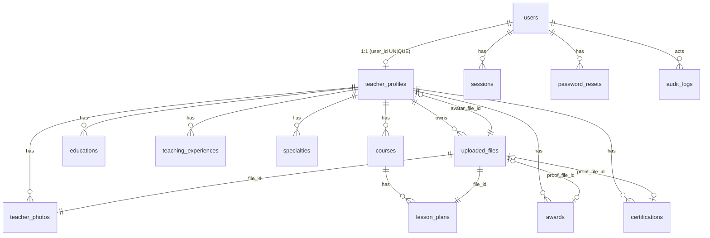
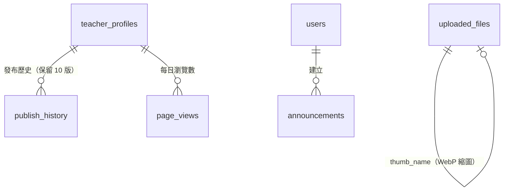

# 系統設計文件

教師個人資料與數位課程展示網站系統（Teacher Showcase）
技術：Python 3.10+ / Flask 3 / SQLite / Jinja2 伺服器端渲染 / 原生 CSS + 少量 JS

> 本文件對應需求書第 15 點的 1–9 項；10–13 項（程式碼、安裝、測試帳號、部署）見 `README.md`。

---

## 1. 系統功能架構

```
┌──────────────────────────────────────────────────────────────────────┐
│                          瀏覽器（桌機／平板／手機）                      │
└───────────────┬─────────────────────────┬────────────────────────────┘
                │ HTTPS（Nginx 反向代理）    │
┌───────────────▼─────────────────────────▼────────────────────────────┐
│ Flask 應用（gunicorn）                                                 │
│  ┌──── 全域安全閘道（每個請求）────────────────────────────────────┐  │
│  │ 1. 驗證登入 Session（伺服器端、閒置 30 分 / 絕對 8 小時過期）      │  │
│  │ 2. CSRF Token 驗證（所有 POST）                                   │  │
│  │ 3. 首次登入強制改密碼                                             │  │
│  │ 4. 安全標頭：CSP、X-Frame-Options、nosniff、HSTS、no-store        │  │
│  └──────────────────────────────────────────────────────────────────┘  │
│  ┌──────────┐ ┌────────────┐ ┌─────────────────────┐ ┌─────────────┐  │
│  │ public   │ │ auth       │ │ editor（註冊兩次）   │ │ admin       │  │
│  │ 首頁搜尋 │ │ 登入/登出  │ │ me     老師本人      │ │ 帳號管理    │  │
│  │ 一頁網   │ │ 忘記/重設  │ │ assist 管理員協助    │ │ 完成度/狀態 │  │
│  │ 檔案下載 │ │ 修改密碼   │ │ 草稿/預覽/發布       │ │ 匯出/紀錄   │  │
│  └──────────┘ └────────────┘ └─────────────────────┘ └─────────────┘  │
│  ┌─────────────┐ ┌──────────────┐ ┌────────────┐ ┌─────────────────┐  │
│  │ profiles    │ │ uploads      │ │ security   │ │ mail            │  │
│  │ 快照/完成度 │ │ 驗證/重編碼  │ │ 雜湊/Session│ │ SMTP / log      │  │
│  └─────────────┘ └──────────────┘ └────────────┘ └─────────────────┘  │
└───────────────┬─────────────────────────┬────────────────────────────┘
          ┌─────▼─────┐             ┌─────▼──────────────┐
          │ SQLite DB │             │ instance/uploads/  │（不在 static，經權限檢查才送出）
          └───────────┘             └────────────────────┘
```

| 模組 | 功能 |
|---|---|
| 公開網站 | 首頁教師卡片、依關鍵字/縣市/領域/學校搜尋、教師一頁網 `/teacher/001`、教案下載 |
| 登入系統 | 登入、登出、忘記密碼（Email 連結 30 分鐘有效）、修改密碼、首次登入強制改密碼、登入失敗 5 次鎖 15 分鐘 |
| 教師後台 | 基本資料、個人照片、課堂照片、學歷、經歷、專長、獲獎、認證、數位課程、教案/教材上傳、完成度、預覽、發布/取消發布 |
| 管理後台 | 新增/編輯/停用/啟用教師、重設密碼（產生一次性臨時密碼）、所有教師完成度/發布狀態/最後修改時間、協助編輯、CSV 匯出（會場手冊用）、操作紀錄 |

---

## 2. 頁面架構

```
公開
├── /                               首頁（網站名稱、搜尋、教師卡片列表）
├── /teacher/<代碼>                 教師一頁網（只顯示已發布快照）
├── /files/<隨機檔名>               圖片 / PDF（依權限送出）
├── /login                          登入
├── /forgot-password                忘記密碼
└── /reset-password/<token>         重設密碼

登入後（共用）
└── /account/password               修改密碼（首次登入強制）

教師後台 /dashboard  ← 只會是「自己」的資料，網址中沒有任何老師 ID
├── /                               總覽：發布狀態、完成度、預覽/發布/取消發布
├── /profile                        基本資料 + 個人照片 + 內部聯繫資料
├── /photos                         課堂照片（多張上傳、說明、刪除）
├── /items/educations               學歷
├── /items/experiences              教學經歷
├── /items/specialties              教學專長
├── /items/awards                   獲獎紀錄（可附證明，不公開）
├── /items/certifications           認證紀錄（可附證明，不公開）
├── /courses                        數位學習課程列表
├── /courses/new | /<id>/edit       課程表單 + 教案/教材上傳
└── /preview                        預覽（與發布後畫面 100% 相同）

管理後台 /admin  ← 僅 admin
├── /                               教師列表（完成度、狀態、最後修改）
├── /teachers/new                   新增教師
├── /teachers/<uid>                 帳號編輯、停用/啟用、重設密碼
├── /teachers/<uid>/edit/...        協助編輯（與教師後台同一套頁面）
├── /export.csv                     匯出
└── /audit                          操作紀錄
```

---

## 3. 使用者流程

**管理員開設帳號**
```
管理員登入 → 新增教師（帳號、姓名、網址代碼 001、Email）
→ 系統產生臨時密碼（只顯示一次，可列印）→ 交給老師
```

**老師首次使用**
```
/login 輸入臨時密碼 → 強制導向「設定新密碼」（其他頁面全部擋住）
→ 總覽頁看到完成度與缺漏項目 → 逐項填寫（每次儲存都是草稿）
→ 預覽 → 發布 → 取得 /teacher/001 公開網址
```

**修改已發布的資料**
```
編輯任何內容 → 狀態顯示「已發布・有未發布的修改」
→ 訪客仍看到舊版本 → 預覽確認 → 重新發布 → 訪客看到新版本
```

**忘記密碼**
```
/forgot-password 輸入帳號或 Email → 不論帳號是否存在都顯示相同訊息
→ Email 收到 30 分鐘有效、只能用一次的連結 → 設定新密碼 → 所有裝置登出
（沒有 Email 的老師 → 請管理員「重設密碼」）
```

**訪客**
```
首頁 → 依縣市 / 領域 / 學校 / 關鍵字篩選 → 點卡片 → 一頁網 → 下載教案 PDF
```

---

## 4. 資料庫 ERD



**擁有權鏈：** `users.id → teacher_profiles.user_id (UNIQUE) → 各子表.profile_id`。
所有子表都直接存 `profile_id`（包含 `lesson_plans`），因此任何一筆資料只要一次 `WHERE id=? AND profile_id=?` 就能確認擁有者，不需多層 JOIN。

---

## 5. 資料表欄位

完整 DDL 見 `app/schema.sql`。時間一律以 UTC `YYYY-MM-DD HH:MM:SS` 儲存，畫面顯示時轉為 Asia/Taipei。

### users
| 欄位 | 型別 | 說明 |
|---|---|---|
| id | INTEGER PK | |
| username | TEXT UNIQUE NOCASE | 登入帳號 |
| password_hash | TEXT | scrypt 雜湊（含 salt），不存明碼 |
| role | TEXT | `admin` / `teacher`（CHECK 限制） |
| display_name | TEXT | 顯示名稱 |
| email | TEXT | 忘記密碼收信用 |
| is_active | INTEGER | 0 = 停用 |
| must_change_password | INTEGER | 1 = 下次登入必須改密碼 |
| failed_login_count / locked_until | | 登入失敗鎖定 |
| last_login_at / password_changed_at / created_at / updated_at | TEXT | |

### sessions
| 欄位 | 說明 |
|---|---|
| token_hash | Cookie 中隨機 token 的 SHA-256（DB 外洩也無法直接登入） |
| user_id | FK users，ON DELETE CASCADE |
| last_seen_at / expires_at | 閒置逾時 / 絕對逾時 |
| ip / user_agent | 稽核用 |

### password_resets
`user_id, token_hash, expires_at, used_at, created_at` — 只存雜湊，一次性。

### teacher_profiles
| 欄位 | 對應調查表 | 公開？ |
|---|---|---|
| user_id UNIQUE | — | — |
| teacher_code UNIQUE | 公開網址 `/teacher/001` | ✓ |
| county | 1-1 縣市 | ✓ |
| school_name | 1-2 學校全銜 | ✓ |
| teacher_name | 1-3 講師姓名 | ✓ |
| job_title | 1-4 職稱 | ✓ |
| phone | 1-5 手機號碼 | **✗ 永不公開** |
| contact_email | 1-6 電子郵件 | **✗ 永不公開** |
| philosophy / slogan | 1-7 教育理念與 Slogan | ✓ |
| avatar_file_id | 1-9 個人照片 | ✓ |
| status | `draft` / `published` | |
| published_snapshot | 發布當下的公開資料 JSON | |
| published_at / created_at / updated_at | | |

### uploaded_files
`profile_id, uploaded_by, category(avatar/class_photo/lesson_plan/material/certificate), stored_name(UUID, UNIQUE), original_name, mime_type, size_bytes, created_at, deleted_at`

### teacher_photos（1-8 課堂照片）
`profile_id, file_id, caption, sort_order, created_at`

### educations（學歷）
`profile_id, school*, department, degree, period, sort_order`

### teaching_experiences（1-10 教學經歷）
`profile_id, organization*, role, period, description, sort_order`

### specialties（1-10 教學專長）
`profile_id, name*, description, sort_order`

### awards（1-11 獲獎）
`profile_id, title*, issuer, award_date, description, proof_file_id（不公開）, sort_order`

### certifications（1-11 認證）
`profile_id, name*, issuer, cert_date, description, proof_file_id（不公開）, sort_order`

### courses（2-1 ~ 2-9）
| 欄位 | 調查表 |
|---|---|
| grade | 2-1 授課年級 |
| student_count INTEGER | 2-2 學生數 |
| subject | 2-3 科目/領域 |
| title* | 2-4 課程名稱 |
| unit | 2-5 單元 |
| objectives | 2-6 學習目標 |
| intro | 2-7 展示課程介紹 |
| four_learning | 2-8 四學運用 |
| ai_usage | 2-9 AI 運用 |

### lesson_plans（2-10 完整教案 / 教材附件）
`profile_id, course_id, file_id, title, plan_type(lesson_plan/material), created_at`

### audit_logs
`actor_id, action, target, detail, ip, created_at`

---

## 6. API 規劃

本系統採伺服器端渲染（表單 POST + 303/302 Redirect），以下即為後端端點規格。所有 POST 皆需 `csrf_token`。

### 公開
| 方法 | 路徑 | 權限 | 說明 |
|---|---|---|---|
| GET | `/` | 任何人 | `?q=&county=&subject=&school=` 搜尋已發布教師 |
| GET | `/teacher/<code>` | 任何人 | 已發布且帳號啟用才回 200，否則 404 |
| GET | `/files/<uuid>.<ext>` | 依規則 | 已發布快照引用 → 公開；否則僅擁有者/管理員 |
| GET | `/healthz` | 任何人 | 健康檢查 |

### 驗證
| 方法 | 路徑 | 說明 |
|---|---|---|
| GET/POST | `/login` | 帳密登入；IP 限流 20 次/10 分；帳號失敗 5 次鎖 15 分 |
| POST | `/logout` | 刪除伺服器端 Session |
| GET/POST | `/forgot-password` | 寄送重設連結（IP 限流 5 次/10 分） |
| GET/POST | `/reset-password/<token>` | 一次性、30 分鐘 |
| GET/POST | `/account/password` | 需登入；改完登出其他裝置 |

### 教師編輯器（`me` = `/dashboard`，`assist` = `/admin/teachers/<uid>/edit`）
| 方法 | 路徑 | 說明 |
|---|---|---|
| GET | `/` | 總覽 |
| GET/POST | `/profile` | 基本資料 + 個人照片（multipart） |
| GET/POST | `/items/<kind>` | 列表 / 新增；kind ∈ educations, experiences, specialties, awards, certifications |
| GET/POST | `/items/<kind>/<id>/edit` | 編輯 |
| POST | `/items/<kind>/<id>/delete` | 刪除 |
| POST | `/items/<kind>/<id>/move/<up\|down>` | 排序 |
| GET/POST | `/photos` | 列表 / 上傳多張 |
| POST | `/photos/<id>/caption` · `/photos/<id>/delete` | |
| GET | `/courses` | 課程列表 |
| GET/POST | `/courses/new` · `/courses/<id>/edit` | |
| POST | `/courses/<id>/delete` | 連同教案 |
| POST | `/courses/<id>/plans` | 上傳教案/教材 PDF |
| POST | `/courses/<id>/plans/<pid>/delete` | |
| GET | `/preview` | 預覽 |
| POST | `/publish` · `/unpublish` | 發布 / 取消發布 |

### 管理員（全部需 admin）
| 方法 | 路徑 | 說明 |
|---|---|---|
| GET | `/admin/` | `?q=&status=published\|draft\|inactive` |
| GET/POST | `/admin/teachers/new` | 建立帳號 + 教師資料（同一交易） |
| GET/POST | `/admin/teachers/<uid>` | 編輯帳號 |
| POST | `/admin/teachers/<uid>/toggle-active` | 停用 / 啟用（停用立即踢出） |
| POST | `/admin/teachers/<uid>/reset-password` | 產生臨時密碼 |
| GET | `/admin/export.csv` | UTF-8 BOM CSV，已防公式注入 |
| GET | `/admin/audit` | 最近 300 筆操作紀錄 |

### 回應碼
`200` 成功；`302/303` 表單成功後導頁；`400` CSRF 失敗或欄位錯誤；`401` 登入失敗；`403` 角色不符；`404` 不存在**或不屬於你**（刻意不回 403，避免洩漏資料是否存在）；`413` 檔案過大；`429` 嘗試次數過多。

---

## 7. 前端頁面設計

**風格：** 明亮的淺灰藍底、白色卡片、主色「黑板藍 #1f5f8b」，點綴色「鉛筆黃 #f0a93b」只用在標題左側線、獲獎圖示、公開頁底線等需要被注意的地方。字體使用系統內建繁中字型（Noto Sans TC / PingFang TC / 微軟正黑體），不依賴外部 CDN（也符合 CSP）。

| 頁面 | 設計重點 |
|---|---|
| 首頁 | Hero 區＋搜尋卡（關鍵字、縣市、領域、學校）；教師卡片網格：照片、姓名、縣市｜學校、職稱、領域標籤、Slogan |
| 一頁網 | 藍色 Hero（大頭照、學校、姓名、職稱、Slogan、領域）→ 黏性章節導覽 → 教育理念 → 專長／經歷學歷（雙欄）→ 課堂照片牆 → 獲獎認證卡 → 課程卡（年級、學生數、學習目標、介紹、綠色「四學運用」與紫色「AI 運用」對照區塊、PDF 下載按鈕） |
| 教師後台 | 左側選單（含狀態與完成度條）＋右側內容；總覽頁最上方即為「發布狀態卡」與預覽/發布按鈕；表單底部固定「儲存草稿」列；公開欄位標綠色「會顯示在公開頁」，手機 Email 卡片以淡紫色「不公開」區隔 |
| 管理後台 | 4 個統計卡、篩選列、教師表格（完成度條、狀態徽章、最後修改、操作） |

**RWD：**
- ≥ 961px：桌機雙欄、表格。
- 641–960px（平板）：後台側欄變成頂部橫向捲動分頁；管理表格自動轉為卡片。
- ≤ 640px（手機）：漢堡選單、所有表單單欄、按鈕最小觸控高度 44px、輸入框字級 16px（避免 iOS 自動放大）。
- 另有列印樣式（一頁網可直接列印成 PDF 給會場使用）。

---

## 8. 後端權限設計

### 8.1 三層防線
1. **身分（Authentication）**：`load_logged_in_user()` 每個請求從 Cookie 取 token → SHA-256 → 查 `sessions` → 檢查絕對到期、閒置逾時、帳號是否停用。
2. **角色（Role）**：
   - `/admin/*`：藍圖層級 `before_request` 統一檢查 `role == 'admin'`，新增路由也不會漏。
   - `/dashboard/*`：只接受 `teacher`。
   - `/admin/teachers/<uid>/edit/*`：只接受 `admin`。
3. **擁有權（Ownership）**：
   - 教師的 `profile` **只從 Session 的 user_id 推得**，網址裡根本沒有老師 ID 可竄改。
   - 子資料一律透過 `owned_or_404(table, id)` → `SELECT … WHERE id = ? AND profile_id = ?`；UPDATE / DELETE 也都帶 `AND profile_id = ?`（雙重保險）。
   - 不屬於自己 → **404**（不是 403），攻擊者無法判斷 ID 是否存在。

### 8.2 管理員協助編輯
同一個 `editor` 藍圖註冊兩次（`me`、`assist`），共用完全相同的程式碼與擁有權檢查，差別只在 `g.profile` 的來源：
```
me     → SELECT … FROM teacher_profiles WHERE user_id = <登入者>
assist → 先檢查 role == admin，再 SELECT … WHERE user_id = <網址 uid> AND role='teacher'
```
所有協助操作在稽核紀錄中以 `assist_` 前綴記錄。

### 8.3 公開資料隔離（草稿 vs. 發布）
- 發布時呼叫 `build_public_snapshot()`，以**白名單**挑欄位存成 JSON；`phone`、`contact_email`、獲獎證明不在白名單中。
- 公開頁與首頁**只讀快照**，不讀即時資料表 → 草稿修改在重新發布前絕不外洩。
- 預覽也使用同一個函式，確保所見即所得。
- 檔案：快照記錄引用的檔名清單；`/files/` 依此判斷是否可公開。草稿中刪除、但仍被已發布版本引用的檔案先軟刪除，重新發布或取消發布後才清除實體檔。

### 8.4 安全性對照表
| 威脅 | 措施 |
|---|---|
| 密碼外洩 | Werkzeug scrypt（含隨機 salt）；密碼規則：≥8 字、英數混合、不同於帳號；臨時密碼只顯示一次 |
| 暴力破解 | 帳號連續失敗 5 次鎖 15 分；IP 限流；不存在帳號也做雜湊比對（防時間差列舉）；錯誤訊息不區分帳號/密碼 |
| SQL Injection | 全部 `?` 參數化；動態表名/欄名只來自程式內白名單 |
| XSS | Jinja2 自動跳脫；換行用「先 escape 再 `<br>`」的 `nl2br`；CSP `script-src 'self'`（無 inline script） |
| CSRF | 每個表單隱藏 token，`hmac.compare_digest` 比對；Cookie `SameSite=Lax`；登入後換新 token |
| Session 劫持/固定 | 隨機 256-bit token、HttpOnly、Secure（HTTPS）、登入時重新產生；DB 只存雜湊 |
| Session 過期 | 閒置 30 分、絕對 8 小時；改密碼/重設/停用時刪除該使用者所有 Session |
| 越權存取 | 見 8.1；自動化測試涵蓋 |
| 惡意上傳 | 副檔名白名單 + 檔頭 magic bytes + Pillow 驗證並**重新編碼**（同時移除 EXIF/GPS）；解壓縮炸彈上限；PDF 檢查檔頭/結尾並拒絕含 JavaScript/Launch/EmbeddedFile；圖片 5MB、PDF 20MB、請求總量上限；UUID 檔名、`O_EXCL` 不覆寫；存放於 static 以外並經權限檢查才送出；回應帶 `nosniff` 與嚴格 CSP；PDF 一律以附件下載 |
| Open Redirect | `next` 只允許站內相對路徑 |
| Clickjacking | `X-Frame-Options: DENY`、`frame-ancestors 'none'` |
| CSV 公式注入 | 匯出時 `= + - @` 開頭加單引號 |
| 敏感頁快取 | 登入後頁面 `Cache-Control: no-store` |

---

## 9. 專案資料夾結構

```
teacher-showcase/
├── app/
│   ├── __init__.py          應用工廠、全域安全閘道、安全標頭、藍圖註冊、錯誤頁
│   ├── config.py            設定（皆可用環境變數覆寫）
│   ├── schema.sql           資料庫結構
│   ├── db.py                連線、參數化查詢、時間工具
│   ├── security.py          密碼雜湊、Session、CSRF、權限裝飾器、限流、稽核
│   ├── auth.py              登入/登出/忘記/重設/修改密碼
│   ├── editor.py            教師編輯器（me / assist 兩種掛載）
│   ├── admin.py             管理後台
│   ├── public.py            首頁、一頁網、檔案下載
│   ├── profiles.py          欄位定義、公開快照、完成度
│   ├── uploads.py           檔案驗證與儲存、WebP 縮圖
│   ├── qr.py                QR Code 產生器（純 Python，免安裝套件）
│   ├── services.py          公開網址、瀏覽統計、公告、帳號期限
│   ├── backup.py            備份與還原
│   ├── mail.py              寄信
│   ├── cli.py               flask 指令：create-admin / seed-demo / purge-sessions
│   ├── seed.py              示範資料
│   ├── templates/
│   │   ├── base.html  macros.html
│   │   ├── auth/      login, forgot_password, reset_password, change_password
│   │   ├── public/    home, teacher
│   │   ├── editor/    layout, overview, profile, items, item_edit, photos, courses, course_form
│   │   ├── admin/     dashboard, teacher_form, credentials, import, import_preview,
│   │   │              announcements, backups, audit
│   │   └── errors/    error
│   └── static/  css/style.css  js/app.js  img/favicon.svg
├── tests/                   64 項自動化測試（test_app.py 權限安全、test_v2.py 第二版功能）
├── deploy/                  nginx.conf、teacher-showcase.service、backup.sh
├── docs/DESIGN.md           本文件
├── instance/                （執行時產生）app.db、uploads/
├── run.py                   開發啟動
├── wsgi.py                  正式環境入口
├── requirements.txt
├── Dockerfile  docker-compose.yml  .env.example
└── README.md
```

---

# 第二版（v2）設計補充

## A. 新增資料表與欄位



| 資料表／欄位 | 說明 |
|---|---|
| `users.prev_login_at` | 上一次登入時間（老師總覽顯示） |
| `users.valid_from` / `valid_until` | 帳號有效期間（YYYY-MM-DD，空白不限）；期間外無法登入，既有 Session 立即失效 |
| `users.keep_public_after_expiry` | 到期後公開頁是否保留 |
| `uploaded_files.thumb_name` | 圖片的 WebP 縮圖（長邊 720px），唯一索引；權限跟隨原圖 |
| `publish_history(profile_id, snapshot, published_at, published_by)` | 每次發布的公開快照；還原只改 `published_snapshot`，不動草稿 |
| `page_views(profile_id, day, views)` | 每日彙總次數，主鍵 (profile_id, day)；不存 IP、User-Agent 或任何訪客資料 |
| `announcements(title, body, starts_on, ends_on, is_pinned, …)` | 管理員公告 |
| `settings(key, value)` | `deadline`（填寫截止日）、`last_backup_at`（最近備份） |

**升級方式**：`db.init_db()` 在每次啟動時執行。只用 `ALTER TABLE … ADD COLUMN` 與 `CREATE TABLE IF NOT EXISTS`，不刪除、不改寫既有資料；可重複執行。舊照片的縮圖在啟動時自動補做。

## B. 新增 API

### 教師編輯器（`/dashboard` 與 `/admin/teachers/<uid>/edit` 共用）
| 方法 | 路徑 | 說明 |
|---|---|---|
| POST | `/autosave/profile` | 自動儲存基本資料文字欄位，回傳 `{"ok": true, "saved_at": "21:03"}`；驗證失敗回 400 與錯誤訊息 |
| POST | `/autosave/course/<id>` | 自動儲存課程；非本人課程回 404 |
| POST | `/reorder/<kind>` | `ids=3,1,2`；kind ∈ educations, experiences, specialties, awards, certifications, photos, courses。後端確認 ID 集合**剛好等於本人全部資料**才更新，否則 409 |
| GET | `/qr.svg`（`?download=1`）、`/qr.png` | 本人公開頁 QR Code |
| POST | `/history/<id>/restore` | 還原指定發布版本（只能還原自己的） |

### 公開
| 方法 | 路徑 | 說明 |
|---|---|---|
| GET | `/teacher/<code>/qr.svg` | 已發布頁面的 QR（分享面板用） |
| GET | `/files/t_<uuid>.webp` | 縮圖；可見性與原圖相同 |
| GET | `/sitemap.xml`、`/robots.txt` | SEO（後台路徑設為 Disallow） |

### 管理員
| 方法 | 路徑 | 說明 |
|---|---|---|
| GET | `/admin/?status=` | 快速篩選：complete, incomplete, low, published, unpublished, changes, must_change, never, stale, inactive |
| GET | `/admin/reminders.csv?status=` | 提醒名單（含尚缺項目、最後更新、最後登入） |
| POST | `/admin/reminders/send` | 依篩選寄送提醒信（需 SMTP） |
| GET/POST | `/admin/import` → `/admin/import/confirm` | 批次匯入：上傳 → 預覽與檢查（不寫入）→ 確認時**後端再完整驗證一次** → 建立帳號並顯示一次性臨時密碼 |
| GET | `/admin/import/template.csv` | 匯入範本 |
| GET/POST | `/admin/announcements` | 公告 CRUD、填寫截止日 |
| GET | `/admin/export.xlsx` | 6 個工作表的完整 Excel |
| GET/POST | `/admin/backups`、GET `/admin/backups/<name>` | 建立／列出／下載備份（檔名白名單驗證） |

## C. 權限與安全（延續第一版，新增項目）
- 所有新端點都在同一個 `editor` 藍圖下，沿用 `before_request` 的身分判斷與 `owned_or_404`；排序端點以「ID 集合完全相等」防止夾帶他人資料。
- 自動儲存與排序使用 `fetch`，同樣需 CSRF Token（表單欄位或 `X-CSRF-Token` 標頭）。
- 批次匯入：預覽頁的資料放在隱藏欄位，**確認時不信任前端**，重新檢查帳號／代碼／Email 是否重複與格式；CSV 自動判斷 UTF-8 與 Big5（Excel 另存常見）。
- 臨時密碼只在回應頁面出現一次；「下載帳號密碼 CSV」在瀏覽器端由頁面表格產生，伺服器不保存明碼。
- 匯出 Excel／CSV 皆防公式注入。
- 縮圖檔名 `t_<uuid>.webp`，存取時查回原圖再套用原圖的公開／私有規則。
- 瀏覽統計不記錄個人資料：只累加每日次數；以 Cookie 記錄「今天看過哪些代碼」避免重複計算；排除爬蟲、老師本人與管理員。
- CSP 新增 `img-src blob:`（瀏覽器端裁切預覽）；仍禁止 inline script。
- 備份還原前自動另存 `before-restore-*.zip`；zip 內容只接受 `app.db` 與 `uploads/<安全檔名>`。

## D. 前端
- 全部為原生 JavaScript（`app/static/js/app.js`），沒有外部 CDN，符合 CSP。
- 自動儲存：停止輸入 2 秒送出；切換分頁時以 `sendBeacon` 補送；狀態以 `aria-live` 播報。
- 拖曳排序：Pointer Events（滑鼠＋觸控），把手為按鈕，可用鍵盤 ↑↓ 移動。
- Lightbox：焦點鎖定在對話框內、Esc 關閉、關閉後焦點回到原圖。
- 裁切：Canvas 實作，輸出長邊最多 1000px 的 JPEG；伺服器仍會重新編碼與驗證。

## E. 未納入本版
- 需求 19「多年度／多活動分類」：需要把 `teacher_profiles` 拆成「老師」與「年度成果」兩層，影響發布、公開網址與匯出，建議確認活動規劃後再實作。
